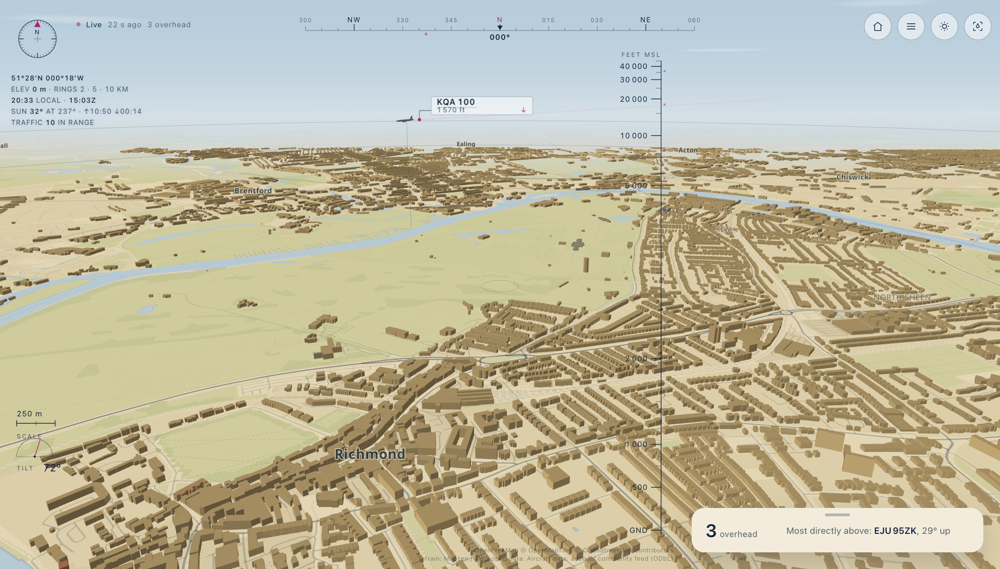
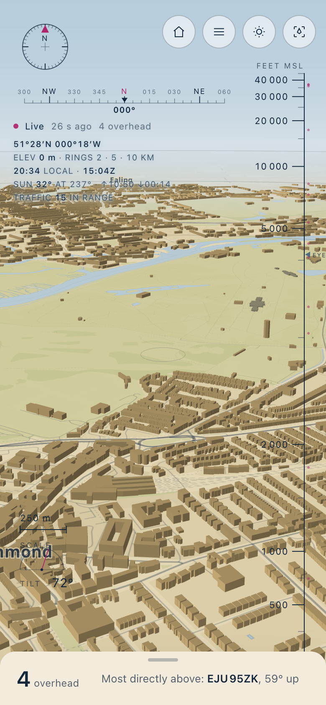
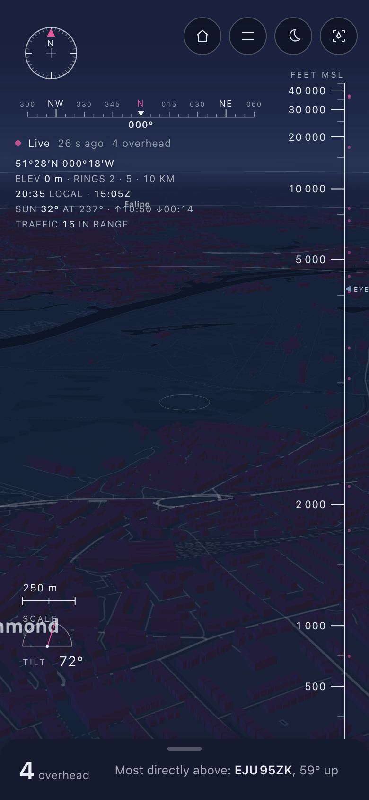
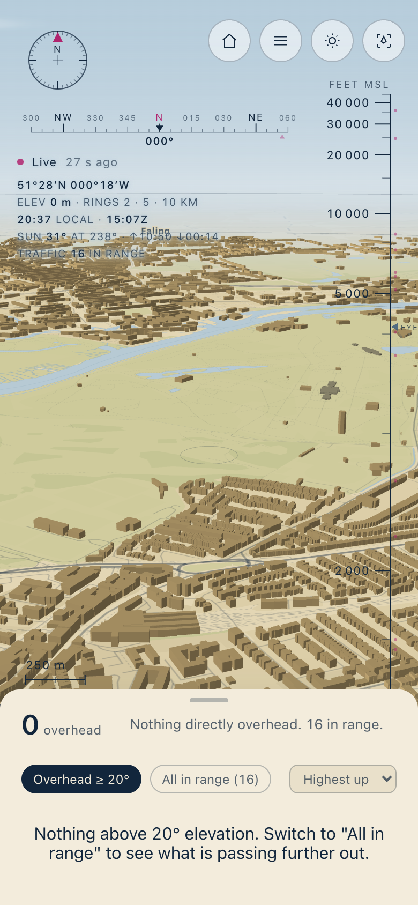
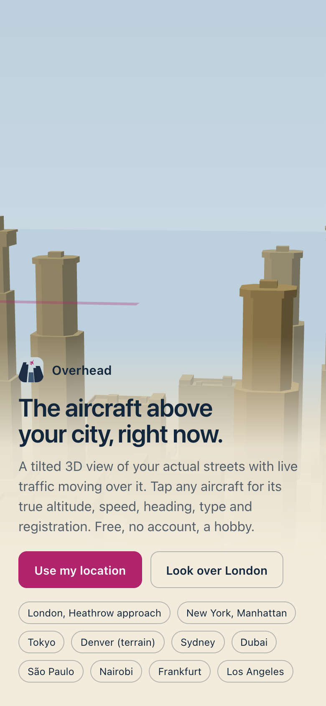
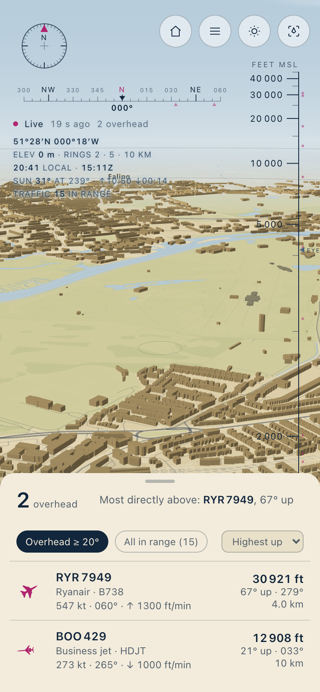
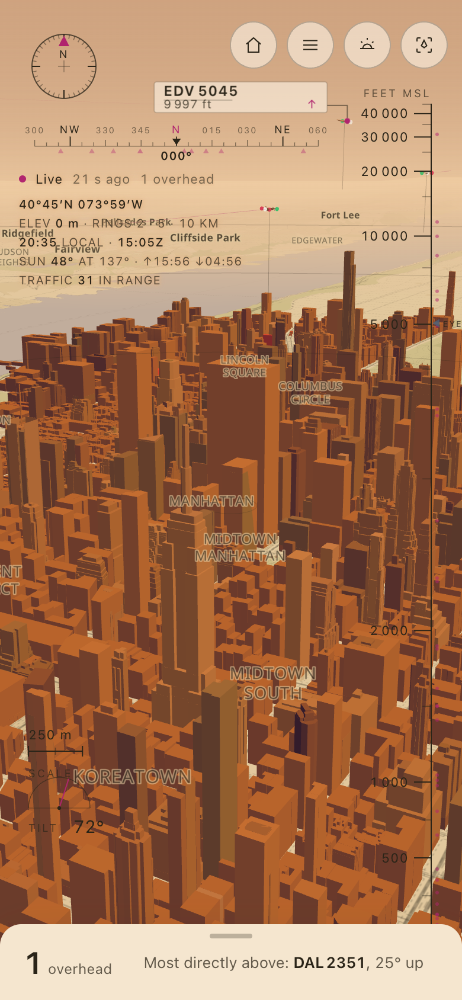
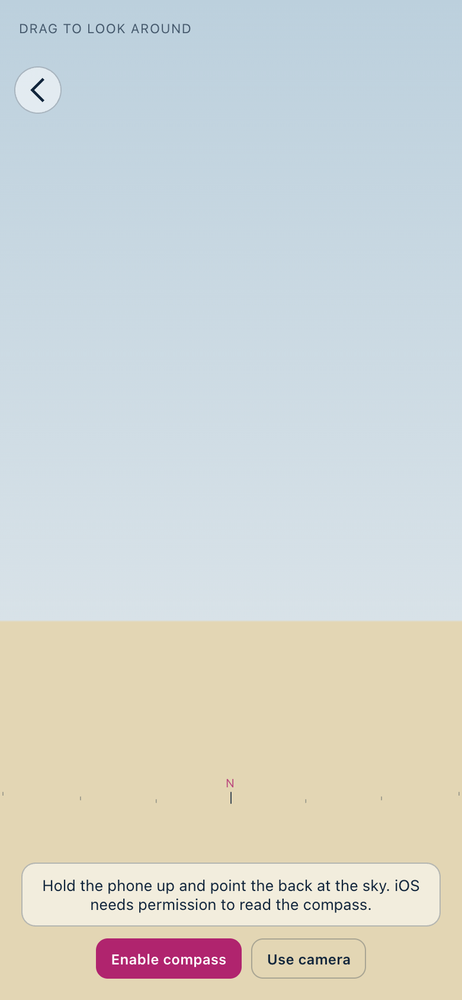
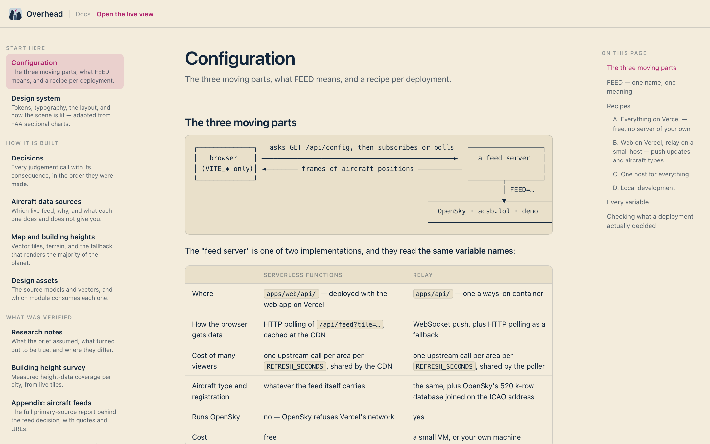

<div align="center">


# Overhead ✈️

**The aircraft above your city, right now — over a tilted 3D view of your actual streets.**

[**🔭 Open the live app**](https://overhead.ijlalahmad.dev) · [**📚 Read the docs**](https://overhead.ijlalahmad.dev/docs) · [**🗺️ Try London**](https://overhead.ijlalahmad.dev/live?at=51.47,-0.30) · [**🌃 Try it at night**](https://overhead.ijlalahmad.dev/live?at=51.47,-0.30&theme=night)

`TypeScript` · `React` · `MapLibre GL JS` · `three.js` · `Fastify` · free to run



</div>

---

## 🛩️ What it does

Open it and the buildings around you stand up in low-poly form. Live traffic moves above them at
readable heights. Tap an aircraft for its true altitude, speed, heading, type and registration, and
orbit a 3D model of what you are looking at.

<table>
<tr>
<td width="33%"></td>
<td width="33%"></td>
<td width="33%"></td>
</tr>
<tr>
<td align="center"><b>🌞 Day</b><br /><sub>Buff grounds, hairline chart linework</sub></td>
<td align="center"><b>🌙 Night</b><br /><sub>Dark buildings, lit streets, nav lights</sub></td>
<td align="center"><b>🔍 Tap anything</b><br /><sub>True altitude, orbitable model</sub></td>
</tr>
</table>

|  | |
|---|---|
| 📏 **Honest heights** | Altitude is compressed so cruise traffic stays in frame, and a ruler down the edge is drawn through *the same function* — so you can see the gridlines bunch up. Every label shows the real barometric altitude. |
| 🛫 **Seven silhouettes** | Wide-body, narrow-body, regional jet, turboprop, business jet, helicopter, light piston — low-poly models with **spinning propellers and rotors**, instanced so fifty aircraft cost a handful of draw calls. |
| 🌍 **Anywhere on Earth** | Buildings extrude where OpenStreetMap has heights and fall back to a deliberate low-rise heuristic where it does not, which is most of the planet. |
| 🌗 **Follows the sun** | Day, golden hour and night are chosen from the real sun elevation at your location, and the lighting follows its azimuth. |
| 🧭 **Point at the sky** | Hold the phone up and the compass places each aircraft by true bearing and elevation. |
| 📖 **A logbook** | Tap "log sighting" and collect stamps for firsts, wide-bodies, rare types and night sightings. Stored in your browser, no account. |
| 🛟 **Degrades honestly** | No WebGL? A sectional-style chart. Low zoom or a slow device? Flat icons on a flat map. Feed unreachable? Clearly-labelled demo traffic. |

<table>
<tr>
<td width="25%"></td>
<td width="25%"></td>
<td width="25%"></td>
<td width="25%"></td>
</tr>
<tr>
<td align="center"><sub>Homepage</sub></td>
<td align="center"><sub>Sorted by how directly overhead</sub></td>
<td align="center"><sub>Golden hour, New York</sub></td>
<td align="center"><sub>Point at the sky</sub></td>
</tr>
</table>

## 📐 The interesting problem

A cruising airliner is eleven kilometres up. Buildings are a hundred metres. At true scale every
interesting aircraft is a dot far above the frame, and the 3D city is pointless. So altitude is
**compressed monotonically** — true to scale near the ground, logarithmic above:

```
visualHeight(h) = h                                      for h ≤ 1 000 m
                = 1000 + 150 · ln(1 + (h − 1000) / 150)   above it
```

The join is C¹-continuous, so an aircraft descending through 1 000 m does not visibly kink, and the
function is invertible, which is what lets the ruler label real altitudes. **One module owns it**, and
a test asserts the ruler's gridlines and the rendered aircraft come from the same function. Flight
level 370 lands about eleven times a 150 m skyline, comfortably in frame.

The compression is never hidden: the ruler shows it, every label carries the true altitude in feet,
and the app says so in its own words the first time you open it.

## 🚀 Run it

```bash
pnpm install
cp .env.example .env     # defaults work as-is
pnpm dev                 # relay on :8787, web on https://localhost:5173
```

The dev server is HTTPS with a self-signed certificate on purpose: phones only expose geolocation,
the camera and orientation sensors to secure origins, so `https://<your-lan-ip>:5173` is what makes
the AR view and "use my location" work on a real device.

Three variables do almost everything:

| | |
|---|---|
| `FEED` | Which live source: `adsblol` (no key), `opensky` (credentials, richer), `demo` (synthetic, offline). |
| `REFRESH_SECONDS` | How often an area is refreshed upstream. The browser is told and paces itself, dead-reckoning in between. |
| `VITE_API_URL` | Where the browser looks for the feed. Blank means this same origin. |

📚 **[docs/configuration.md](docs/configuration.md)** is the full reference, with a recipe per deployment.

## ☁️ Deploy

| | Free, all on Vercel | With the relay |
|---|---|---|
| **What runs** | the web app plus three small functions | the above, or any static host, plus one always-on container |
| **Updates** | polling, cached per area at the CDN | WebSocket push |
| **Aircraft types** | whatever the feed carries | plus OpenSky's 520 k-row database, joined on the ICAO address |
| **Set** | `FEED=adsblol`, `REFRESH_SECONDS=30` | `VITE_API_URL` on the web, the feed variables on the relay |
| **Cost** | nothing | a small VM, or your own machine |

> ⚠️ **OpenSky cannot be used from Vercel.** Measured from functions in two regions and from the edge
> runtime, every OpenSky hostname times out, while adsb.lol answers in ~57 ms from the same function.
> The relay runs it happily. The reasoning and the measurements are in
> [docs/decisions.md](docs/decisions.md).

`fly.toml`, `render.yaml` and `apps/api/Dockerfile` are ready for the relay; `apps/web/vercel.json`
carries the web build. Full walkthrough in [docs/configuration.md](docs/configuration.md).

## 🧩 How it is built

```
browser ──subscribes to ~20 km geohash tiles──►  feed server  ──one call per area per interval──►  ADS-B feed
   │                                                  │
   │  MapLibre owns terrain, extruded buildings        │  the poller (or the CDN) makes many viewers
   │  and the camera; a three.js custom layer          │  of one area cost a single upstream call
   │  shares its matrix to draw aircraft, trails,      │
   │  drop lines, nav lights and clouds                └── joins aircraft type and registration
   │
   └── between polls every aircraft is dead-reckoned from its last speed, track and vertical rate,
       then eased onto the next real position, so nothing teleports at 60 fps
```

| Path | What lives there |
|---|---|
| [`packages/altitude`](packages/altitude) | The one compression function, its inverse, the ruler ticks — with monotonicity tests |
| [`packages/shared`](packages/shared) | Types, unit conversion at the boundary, geohash tiles, geo maths, category tables, feed parsers, dead reckoning |
| [`apps/api`](apps/api) | Fastify relay: feed providers, tile poller with clustering and credit budgeting, WebSocket fan-out, aircraft-database join |
| [`apps/web`](apps/web) | React PWA: map style, three.js aircraft layer, HUD, detail panel, logbook, AR view, docs reader, and the serverless functions in `api/` |
| [`design/`](design) | The source 3D models and vectors, with a note on which module consumes each |
| [`docs/`](docs) | Configuration, design system, every decision, and the research behind them |

## 📚 Documentation

Everything was written down as it was built, and it is readable in the app itself with a proper
reading layout, an index and per-page contents:

<div align="center">
<a href="https://overhead.ijlalahmad.dev/docs"></a>
</div>

| | |
|---|---|
| [⚙️ Configuration](docs/configuration.md) | The three moving parts, what `FEED` means, a recipe per deployment |
| [🎨 Design system](docs/design.md) | Tokens, typography, layout and scene treatment, adapted from FAA sectional charts |
| [🧭 Decisions](docs/decisions.md) | Every judgement call with its consequence, in the order they were made |
| [📡 Aircraft data](docs/data-source.md) | Which feed, why, and what each one does and does not give you |
| [🗺️ Map and heights](docs/map-data.md) | Vector tiles, terrain encoding, and the fallback that renders most of the planet |
| [🔬 Research notes](docs/research-notes.md) | What the brief assumed, what turned out to be true, and where they differ |

## 🧪 Scripts

```bash
pnpm test                      # 49 unit tests
pnpm typecheck                 # all four workspaces
pnpm survey:buildings          # measure height-data coverage per city, from live tiles
pnpm icons                     # rasterise the PWA icons from the SVG app icon
node scripts/readme-shots.mjs  # regenerate the screenshots in this file
```

## 🙏 Credits

Map © [OpenFreeMap](https://openfreemap.org) © [OpenMapTiles](https://openmaptiles.org), data ©
[OpenStreetMap](https://www.openstreetmap.org/copyright) contributors (ODbL). Terrain: Mapzen / AWS
open data terrain tiles. Aircraft positions: [adsb.lol](https://adsb.lol) (ODbL) or
[The OpenSky Network](https://opensky-network.org). Magnetic declination: NOAA. The palette is adapted
from FAA sectional charts.

A hobby project. No accounts, no tracking, no paid tier — your logbook lives in your own browser.
